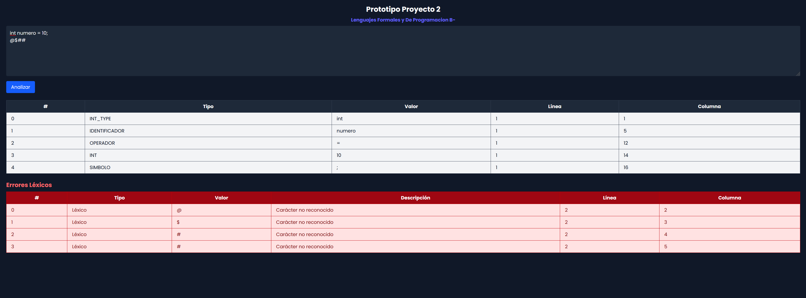

#### Lenguajes Formales y De Programacion B-

Prototipo para el Proyecto 2

**Instrucciones**

## Backend

Para la ejecucion del Backend posicionarse en la raiz de la carpeta Clase8

Si es primera vez ejecutar el siguiente comando:

        npm i 

Seguidamente se instalaran los paquete para iniciar el servidor en el package.json se uso la dependencia nodemon se configuro como server por lo tanto para la ejecucion del backend seria de esta manera.

        npm run server

---

## Frontend

Para la ejecucion del Frontend posicionarse en la carpeta llamada `Frontend` ejecutar los siguientes comandos:

        npm i

Se instalarán las dependencias, para el estilo de pagina se uso tailwindcss para mas informacion pueden visitar su sitio web de como funciona:

    https://tailwindcss.com/

Para levantar el frontend ejecutar 

        npm run dev
        
Al ejecutar este comando nuestra aplicacion se escuchara en el puerto :5173

